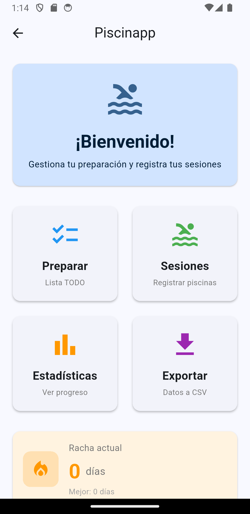
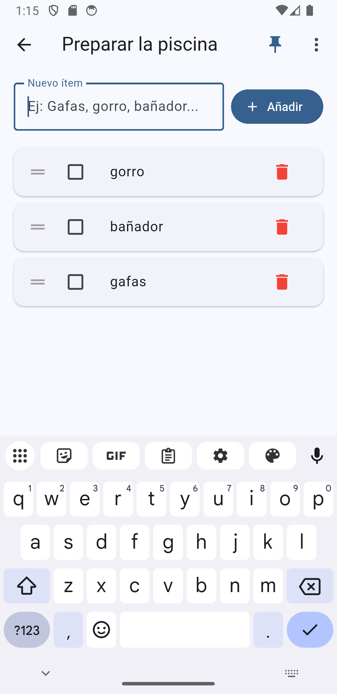
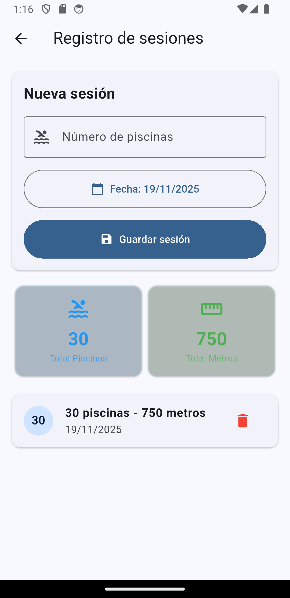
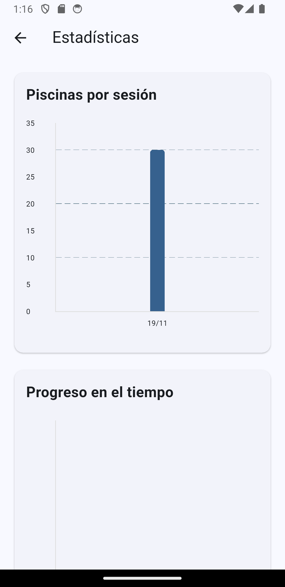
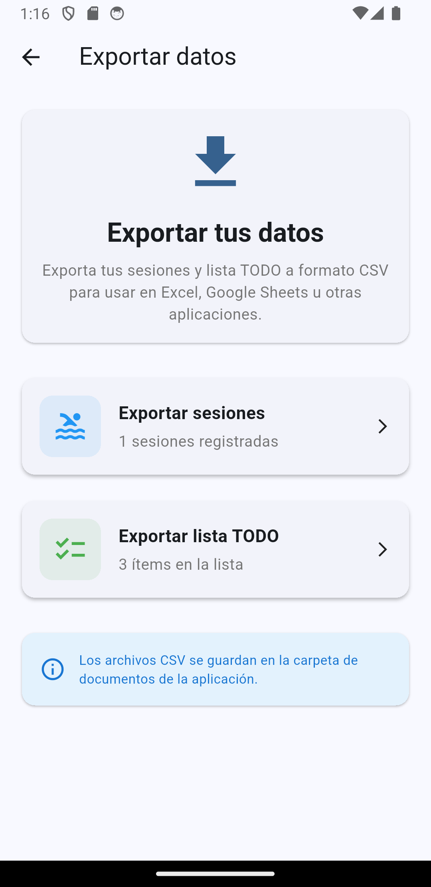
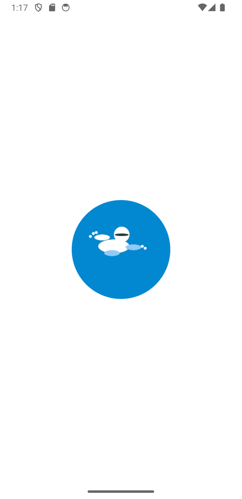

# 🏊 Piscinapp

**Aplicación móvil Flutter para gestionar tu preparación y registro de sesiones de natación**

[](https://flutter.dev)
[](https://dart.dev)
[](LICENSE)
[](https://www.android.com)

---

## 📱 Descripción

**Piscinapp** es una aplicación Flutter diseñada para nadadores que desean organizar su equipamiento antes de cada sesión y llevar un registro detallado de su progreso en la piscina. 

Con una interfaz intuitiva y Material Design 3, te ayuda a:
- ✅ Crear listas de verificación personalizadas (gafas, gorro, toalla, etc.)
- 🏊 Registrar cada sesión con número de piscinas y conversión automática a metros
- 📊 Visualizar tu progreso con gráficas interactivas
- 🔥 Mantener rachas de días consecutivos nadando
- 🎯 Establecer y seguir objetivos semanales
- 💾 Exportar tus datos a CSV para análisis externos

---

## ✨ Características Principales

### 📋 Lista TODO Inteligente
- Crea tu lista de equipamiento perfecta
- **Chincheta**: Guarda una "lista base" que se carga automáticamente
- Drag & drop para reordenar ítems
- Edición inline con doble clic
- Marcar/desmarcar con un toque

### 🏊 Registro de Sesiones
- Ingresa número de piscinas (conversión automática a metros: 1 piscina = 25m)
- Selector de fecha con calendario
- Actualización automática de rachas
- Historial completo con opción de eliminar

### 📊 Estadísticas Visuales
- **Gráfica de barras**: Piscinas por sesión
- **Gráfica de línea**: Progreso acumulado en el tiempo
- **Tarjetas informativas**: Racha actual, mejor racha, objetivo semanal
- **Resumen completo**: Total de sesiones, piscinas, metros y promedio

### 📁 Exportación de Datos
- Exporta sesiones a CSV (fecha, piscinas, metros)
- Exporta lista TODO a CSV (ítem, completado)
- Compatible con Excel y Google Sheets

### 🎨 Diseño Moderno
- Material Design 3
- Tema azul acuático
- Splash screen animado
- Iconos intuitivos con emojis
- Navegación fluida con transiciones

---

## 📸 Capturas de Pantalla

### Dashboard Principal


### Lista TODO con Drag & Drop


### Registro de Sesiones


### Estadísticas y Gráficas


### Exportación de Datos


### Splash Screen


---

## 🚀 Instalación

### Requisitos Previos
- Flutter SDK 3.5.4 o superior
- Dart SDK 3.5.4 o superior
- Android Studio / VS Code
- Dispositivo Android o emulador

### Pasos de Instalación

1. **Clonar el repositorio**
   ```bash
   git clone https://github.com/danillacer/piscinApp.git
   cd piscinApp
   ```

2. **Instalar dependencias**
   ```bash
   flutter pub get
   ```

3. **Ejecutar la aplicación**
   ```bash
   flutter run
   ```

4. **Generar APK de release** (opcional)
   ```bash
   flutter build apk --release
   ```
   El APK estará en: `build/app/outputs/flutter-apk/app-release.apk`

---

## 🛠️ Tecnologías Utilizadas

| Dependencia | Versión | Propósito |
|------------|---------|-----------|
| **flutter** | 3.5.4 | Framework principal |
| **hive** | 2.2.3 | Base de datos NoSQL local |
| **hive_flutter** | 1.1.0 | Integración Hive con Flutter |
| **provider** | 6.1.2 | Gestión de estado reactivo |
| **fl_chart** | 0.69.0 | Gráficas interactivas |
| **path_provider** | 2.1.4 | Acceso al sistema de archivos |
| **intl** | 0.20.2 | Internacionalización y formato de fechas |

### DevDependencies
- **build_runner** (2.4.13): Generación de código
- **hive_generator** (2.0.1): Adaptadores Hive automáticos
- **flutter_lints** (5.0.0): Análisis estático de código

---

## 📁 Estructura del Proyecto

```
lib/
├── main.dart                    # Punto de entrada
├── app.dart                     # Root widget con providers
├── models/                      # Modelos de datos Hive
│   ├── todo_item.dart
│   ├── swimming_session.dart
│   └── user_settings.dart
├── providers/                   # Gestión de estado
│   ├── todo_provider.dart
│   └── session_provider.dart
├── services/                    # Servicios de persistencia
│   └── storage_service.dart
├── pages/                       # Pantallas de la app
│   ├── home_page.dart
│   ├── todo_page.dart
│   ├── sessions_page.dart
│   ├── charts_page.dart
│   ├── export_page.dart
│   └── splash_screen.dart
└── widgets/                     # Componentes reutilizables
    └── todo_item_widget.dart
```

---

## 🎯 Casos de Uso

### 📝 Antes de ir a la piscina
1. Abre la app y ve a **"Preparar"**
2. Revisa tu lista de equipamiento
3. Marca cada ítem conforme lo guardas en tu bolsa
4. ¡Listo para nadar!

### 🏊 Después de nadar
1. Ve a **"Sesiones"**
2. Ingresa cuántas piscinas nadaste (ej: 40)
3. Selecciona la fecha (si no es hoy)
4. Guarda la sesión
5. Tu racha se actualiza automáticamente

### 📊 Revisar tu progreso
1. Ve a **"Estadísticas"**
2. Observa tus gráficas de progreso
3. Revisa tu racha actual y mejor racha
4. Comprueba si alcanzaste tu objetivo semanal

### 💾 Exportar tus datos
1. Ve a **"Exportar"**
2. Elige qué exportar (sesiones o lista TODO)
3. Los archivos CSV se guardan automáticamente
4. Ábrelos en Excel o Google Sheets

---

## 🔥 Sistema de Rachas

El sistema de rachas motiva la consistencia:

- **Racha actual**: Días consecutivos con al menos 1 sesión
- **Mejor racha**: Tu récord histórico
- La racha se rompe si pasas un día sin nadar
- Múltiples sesiones en el mismo día cuentan como 1 día
- Se calcula automáticamente al guardar sesiones

---

## 🎯 Objetivos Semanales

Establece metas realistas:

- Define cuántas piscinas quieres nadar por semana
- La semana va de lunes a domingo
- Barra de progreso visual
- Celebración al alcanzar el 100%
- Se reinicia cada lunes automáticamente

---

## 📦 Base de Datos

Usa **Hive** (NoSQL local) para persistencia:

```dart
// TypeAdapters registrados:
- TypeId(0): TodoItem
- TypeId(1): SwimmingSession  
- TypeId(2): UserSettings

// Boxes:
- todos: Lista de ítems TODO
- baseList: Lista base para chincheta
- sessions: Historial de sesiones
- settings: Configuración y rachas
```

Los datos se guardan automáticamente en cada cambio.

---

## 🤝 Contribuir

Las contribuciones son bienvenidas:

1. Fork el proyecto
2. Crea una rama para tu feature (`git checkout -b feature/nueva-funcionalidad`)
3. Commit tus cambios (`git commit -m 'feat: añadir nueva funcionalidad'`)
4. Push a la rama (`git push origin feature/nueva-funcionalidad`)
5. Abre un Pull Request

### Convenciones de Commits
Usamos [Conventional Commits](https://www.conventionalcommits.org/):
- `feat:` Nueva funcionalidad
- `fix:` Corrección de bugs
- `docs:` Cambios en documentación
- `style:` Formato, espacios, etc.
- `refactor:` Refactorización de código
- `test:` Añadir o modificar tests
- `chore:` Mantenimiento general

---

## 📄 Licencia

Este proyecto está bajo la Licencia MIT. Ver el archivo [LICENSE](LICENSE) para más detalles.

---

## 👨‍💻 Autor

**Danillacer**
- GitHub: [@danillacer](https://github.com/danillacer)

---

## 🙏 Agradecimientos

- [Flutter Team](https://flutter.dev) por el increíble framework
- [Hive](https://docs.hivedb.dev) por la base de datos rápida y eficiente
- [fl_chart](https://pub.dev/packages/fl_chart) por las hermosas gráficas
- Comunidad Flutter por el soporte y recursos

---

## 📮 Contacto y Soporte

- **Issues**: [GitHub Issues](https://github.com/danillacer/piscinApp/issues)
- **Discusiones**: [GitHub Discussions](https://github.com/danillacer/piscinApp/discussions)

---

## 🗺️ Roadmap

Funcionalidades planeadas para futuras versiones:

- [ ] 🌙 Modo oscuro
- [ ] 🌐 Soporte multiidioma (inglés, español)
- [ ] ☁️ Sincronización en la nube (opcional)
- [ ] 🏆 Sistema de logros y medallas
- [ ] 📱 Widget de home screen
- [ ] ⌚ Integración con smartwatches
- [ ] 📸 Fotos de sesiones
- [ ] 👥 Modo equipo/compartido
- [ ] 🎵 Playlist de natación integrada

---

<div align="center">

**¡Hecho con ❤️ y Flutter!**

🏊‍♂️ **Nada más, preocúpate menos** 🏊‍♀️

</div>
